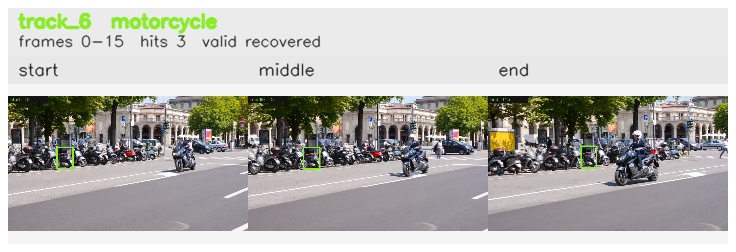

# davis__scooter_exit_reenter__scooter_black / track_6

## Summary
- class: motorcycle (3)
- frames: 0-15 (16 frame span)
- hits: 3
- valid track: yes
- had recovery: yes
- relinked from: none
- fragment track ids: 6
- avg visual similarity: 0.8151
- total misses: 6
- max miss streak: 5

## Label Mix
- motorcycle (3): 3 detections, confidence sum 1.936

## Relink Edges
- none

## Event Timeline
- frame 0: created
- frame 5: activated
- frame 10: lost
- frame 15: closed
- frame 15: recovered
- frame 20: lost

## Key Frames
- start: frame 0, fragment 6, [image](frames/start_f0000.jpg)
- middle: frame 5, fragment 6, [image](frames/middle_f0005.jpg)
- end: frame 15, fragment 6, [image](frames/end_f0015.jpg)

[track metadata](track.json)
