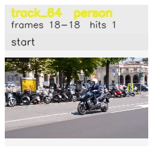

# davis__scooter_exit_reenter__scooter_black / track_64

## Summary
- class: person (0)
- frames: 18-18 (1 frame span)
- hits: 1
- valid track: no
- had recovery: no
- relinked from: none
- fragment track ids: 64
- avg visual similarity: n/a
- total misses: 7
- max miss streak: 7

## Label Mix
- person (0): 1 detections, confidence sum 0.309

## Relink Edges
- none

## Event Timeline
- frame 18: closed
- frame 18: created
- frame 19: lost

## Key Frames
- start: frame 18, fragment 64, [image](frames/start_f0018.jpg)

[track metadata](track.json)
