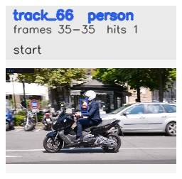

# davis__scooter_exit_reenter__scooter_black / track_66

## Summary
- class: person (0)
- frames: 35-35 (1 frame span)
- hits: 1
- valid track: no
- had recovery: no
- relinked from: none
- fragment track ids: 66
- avg visual similarity: n/a
- total misses: 1
- max miss streak: 1

## Label Mix
- person (0): 1 detections, confidence sum 0.310

## Relink Edges
- none

## Event Timeline
- frame 35: closed
- frame 35: created
- frame 40: lost

## Key Frames
- start: frame 35, fragment 66, [image](frames/start_f0035.jpg)

[track metadata](track.json)
