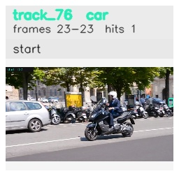

# davis__scooter_exit_reenter__scooter_black / track_76

## Summary
- class: car (2)
- frames: 23-23 (1 frame span)
- hits: 1
- valid track: no
- had recovery: no
- relinked from: none
- fragment track ids: 76
- avg visual similarity: n/a
- total misses: 7
- max miss streak: 7

## Label Mix
- car (2): 1 detections, confidence sum 0.335

## Relink Edges
- none

## Event Timeline
- frame 23: closed
- frame 23: created
- frame 24: lost

## Key Frames
- start: frame 23, fragment 76, [image](frames/start_f0023.jpg)

[track metadata](track.json)
