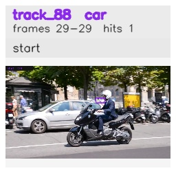

# davis__scooter_exit_reenter__scooter_black / track_88

## Summary
- class: car (2)
- frames: 29-29 (1 frame span)
- hits: 1
- valid track: no
- had recovery: no
- relinked from: none
- fragment track ids: 88
- avg visual similarity: n/a
- total misses: 7
- max miss streak: 7

## Label Mix
- car (2): 1 detections, confidence sum 0.360

## Relink Edges
- none

## Event Timeline
- frame 29: closed
- frame 29: created
- frame 30: lost

## Key Frames
- start: frame 29, fragment 88, [image](frames/start_f0029.jpg)

[track metadata](track.json)
