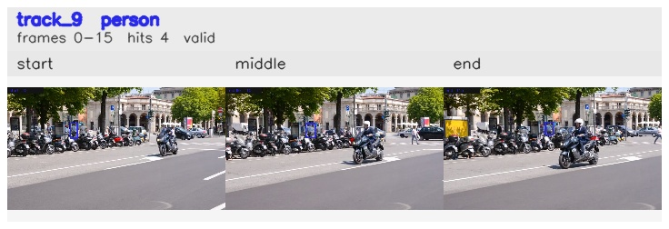

# davis__scooter_exit_reenter__scooter_black / track_9

## Summary
- class: person (0)
- frames: 0-15 (16 frame span)
- hits: 4
- valid track: yes
- had recovery: no
- relinked from: none
- fragment track ids: 9
- avg visual similarity: 0.8277
- total misses: 5
- max miss streak: 5

## Label Mix
- person (0): 4 detections, confidence sum 1.608

## Relink Edges
- none

## Event Timeline
- frame 0: created
- frame 5: activated
- frame 15: closed
- frame 20: lost

## Key Frames
- start: frame 0, fragment 9, [image](frames/start_f0000.jpg)
- middle: frame 10, fragment 9, [image](frames/middle_f0010.jpg)
- end: frame 15, fragment 9, [image](frames/end_f0015.jpg)

[track metadata](track.json)
