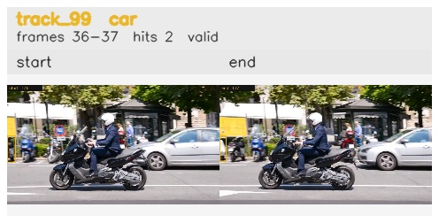

# davis__scooter_exit_reenter__scooter_black / track_99

## Summary
- class: car (2)
- frames: 36-37 (2 frame span)
- hits: 2
- valid track: yes
- had recovery: no
- relinked from: none
- fragment track ids: 99
- avg visual similarity: 0.7075
- total misses: 5
- max miss streak: 5

## Label Mix
- car (2): 1 detections, confidence sum 0.565
- motorcycle (3): 1 detections, confidence sum 0.515

## Relink Edges
- none

## Event Timeline
- frame 36: created
- frame 37: activated
- frame 37: closed
- frame 38: lost

## Key Frames
- start: frame 36, fragment 99, [image](frames/start_f0036.jpg)
- end: frame 37, fragment 99, [image](frames/end_f0037.jpg)

[track metadata](track.json)
